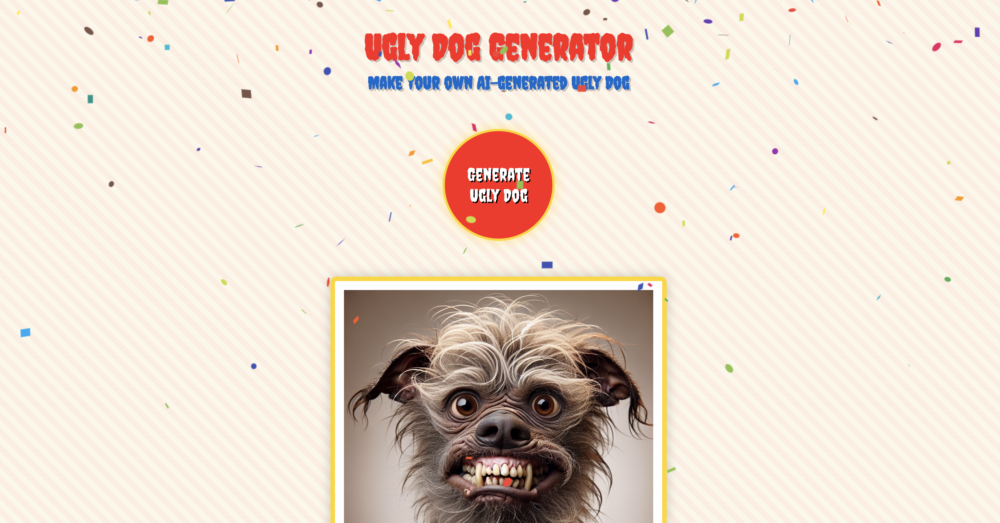
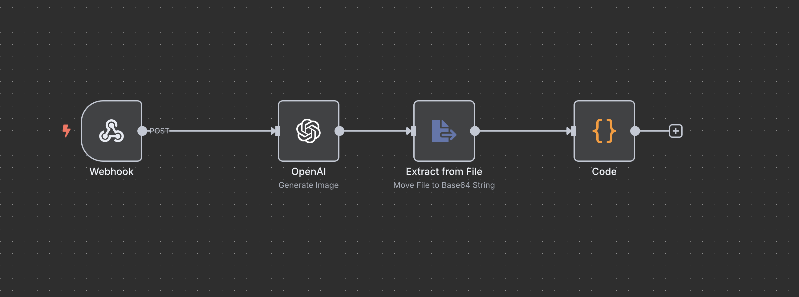

<div align="center">

# 🎪 Ugly Dog Generator 🐶

</div>

### Web Interface




## 💡 The Core Idea: What & Why

This project is a simple web app that generates wonderfully ugly, AI-created dogs in the style of a vintage sideshow with a single click.

It was built as a fun, hands-on coding exercise to answer a practical question: **How do you connect a playful React frontend to a real backend workflow (built with n8n) via webhooks?** This generator is the quirky result of that experiment.

## 🚀 Live Demo

See it in action and generate your own ugly dog right here:

<a href="https://ddave82.github.io/uglydoggenerator/" target="_blank">Ugly Dog Generator</a>

---

## ✨ Features

* **One Click, One Ugly Dog:** Get a uniquely weird, adorable, or hideous AI-generated dog every time you hit the big buzzer.
* **1920s Sideshow Design:** Confetti, buzzers, applause, and retro fonts create the fun atmosphere of a weird old fairground.
* **Sound & Animations:** Celebrate every generated dog with sound effects and cheers.
* **Download & Share:** Save your favorite creation or send it to a friend via email.
* **Fully Responsive:** Works on any device, from desktop to mobile.

### n8n Workflow




---

## 🛠️ For Developers: Getting Started

1.  **Clone this repository:**
    ```sh
    git clone [https://github.com/Ddave82/uglydoggenerator.git](https://github.com/Ddave82/uglydoggenerator.git)
    cd uglydoggenerator
    ```

2.  **Install dependencies:**
    ```sh
    npm install
    ```

3.  **Start the development server:**
    ```sh
    npm start
    ```
    The app will be running on `http://localhost:3000`.

## ⚙️ Technology Stack

* **React + TypeScript**
* **Styled Components** for styling
* **React Confetti** for celebration effects
* **use-sound** for audio effects

## 📁 Project Structure

```bash
/src
  /styles
    GlobalStyles.ts      # Global circus theme
  App.tsx                # Main application
/public
  /sounds
    applause.mp3         # Applause sound
    buzzer.mp3           # Buzzer sound
/docs
  screenshot1.png        # Screenshot of the web app
  screenshot2.png        # Screenshot of the n8n workflow
  screenshot_prompt.png  # Screenshot of the image generation prompt
